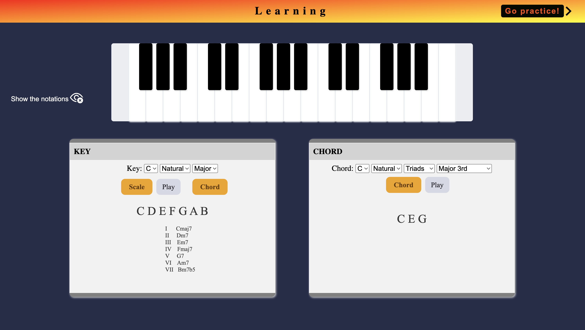
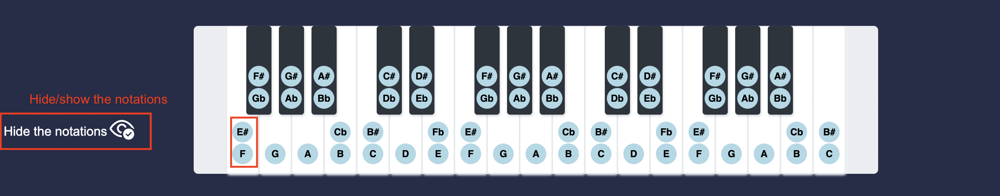
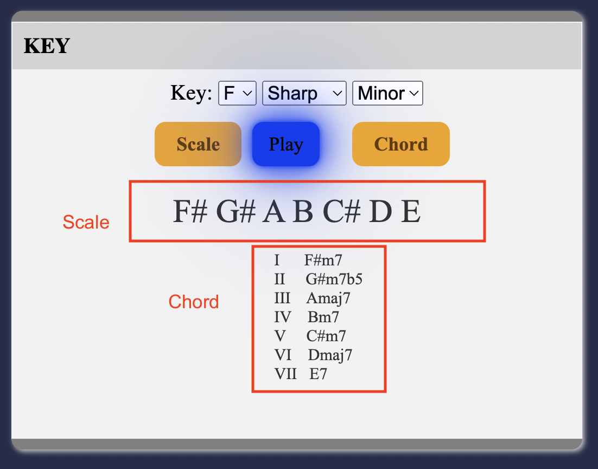
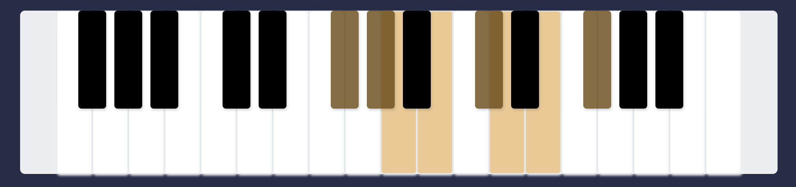
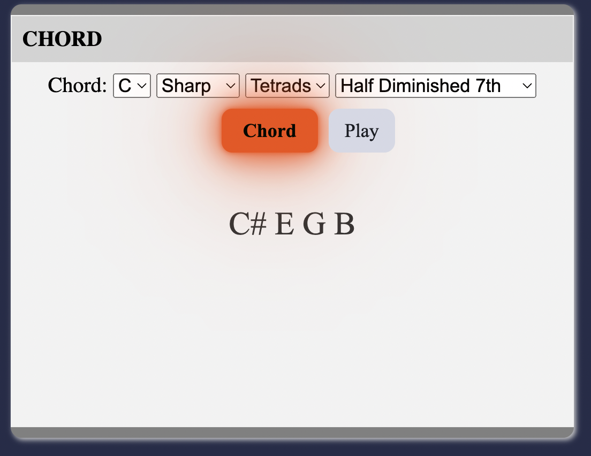
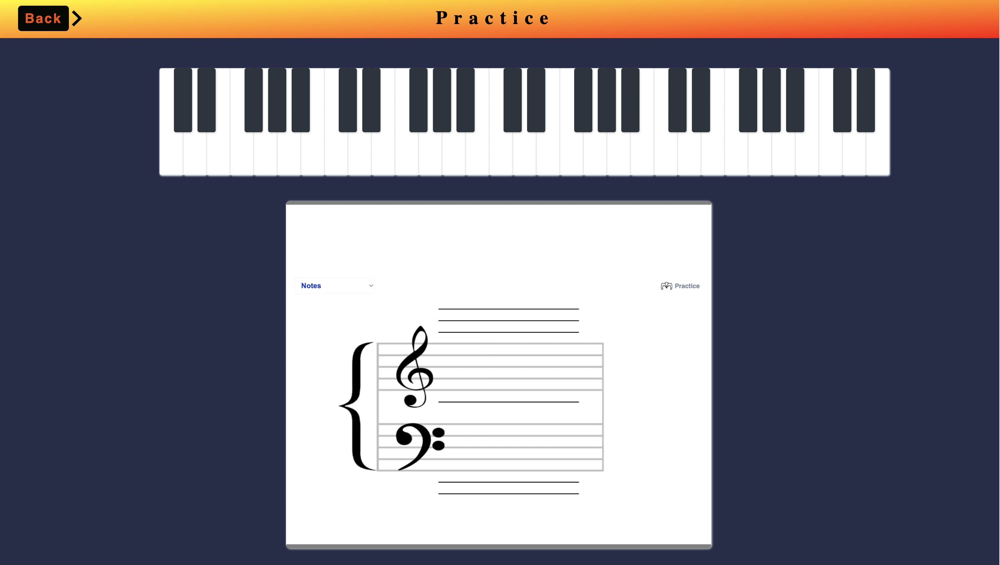
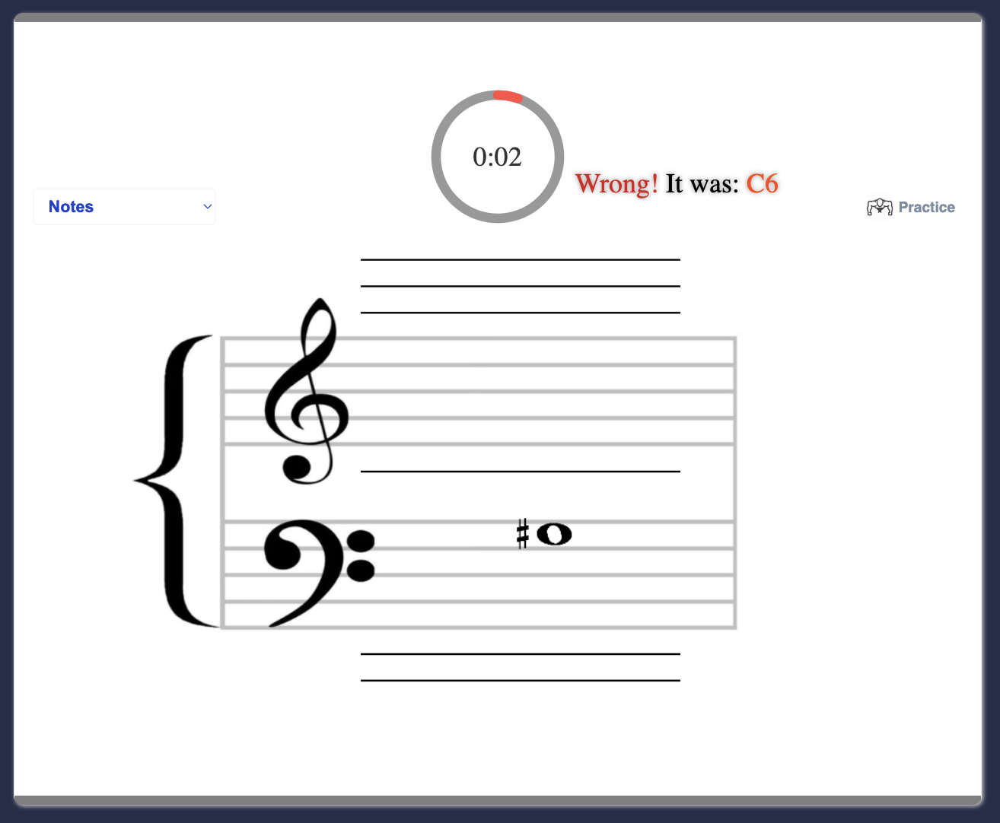
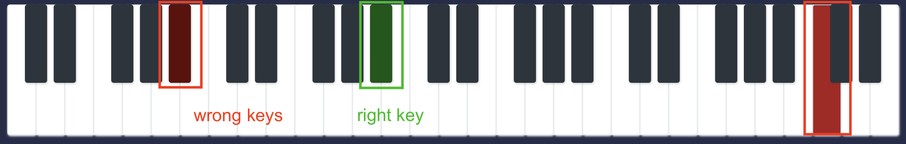
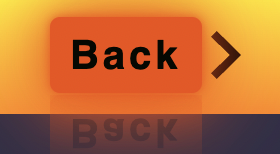

# ACTAM-Project: Piano Basis

- by Xinmeng Luan, Maksim Ste, Jian Zhou, 07-02-2023

This is an interface for piano beginners. 
It is divided into two parts: learning and practice.
It helps you get familiar with the piano keyboard, 
learn notes,
and how to play different scales and chords on the piano.
Don't doubt, it can help you get started with the piano easily. 
Try it now!

## Learning

- The first step for the beginner is to learn the keyboard (F2 to C5).
  When the mouse is near a key, the corresponding note name will be displayed.
By clicking the key, its sound is played.
By clicking 
*Hide/Show the notations* button, you could check the note for each key.

- Then go to the KEY box on the left, where you could learn about the key. 
You need to select a key at first.
The selected contents are:\
 C | D | E | F | G | A | B \
 Natural | Sharp | Flat  \
 Major | Minor \
Then, by clicking *Scale* or *Chord* button, the corresponding notes 
and chords are shown below. Particularly, when clicking *Scale* button,
another *Play* button shows. When clicking it, the sound of the notes in
the scale are played one by one with highlighting of the keys simultaneously.

- The CHORD box on the right has the similar function of the KEY box. 
The selected contents for chords are:\
C | D | E | F | G | A | B \
Natural | Sharp | Flat  \
Triads | Tetrads\
Major 7th | Minor 7th | Dominant 7th | Diminished 7th | Half Diminished 7th Augmented 7th | Augmented Major 7th\
Also the *Play* button shows after clicking the *Chord* button. This time the sound of the notes in
the scale are played together as a chord.

- After learning the theory part, you could go on practice by clicking 
the *Go Practice!* button in the upper right corner.

## Practice

Here we design a game to help you check the knowledge you 
have learned more easily :)
To be more precise you will learn how to read notes from sheets.

- The keyboard is remained on the top, expanding the register to C2-E6 
as a reference.

- Then you could start the game in PRACTICE box below. Click *Practice* 
button to start. Here is the instruction:\
Notes appear randomly on the staff corresponding to 
treble and bass clef. You could input your answer through keyboard on
your computer or click the virtual keyboard above. \
You have 10 seconds to answer. When the progress bar of the timer reaches the end, the time is up. 
If you are wrong the application will dye the correct key into green to help you out. 
The game ends when you go though 5 notes.

- You could go back to the learning part by clicking
  the *Back* button in the upper left corner.

